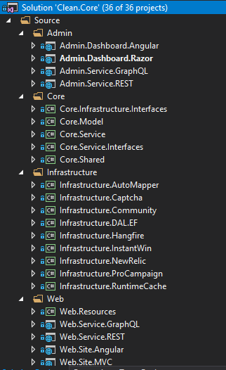
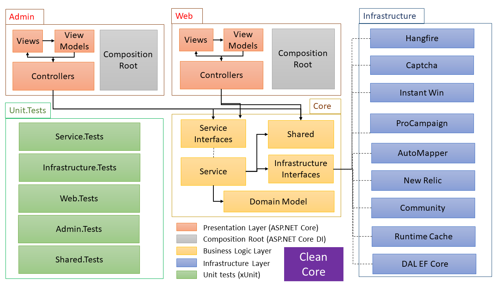

# Clean core
A .Net core monolith web project template using [clean architecture](https://blog.cleancoder.com/uncle-bob/2012/08/13/the-clean-architecture.html)

## 1. Author

Nalijaona Irina Andriamifidy  
@sourcewalker

## 2. Structure

This Template is as ASP.NET Core web project using .NET Core 2.2 structured as following:  

  
*Fig. 1: Clean Core VS Project Structure*

## 3. Achitecture

The architectural overview of the template is resumed as per the following image:

  
*Fig. 2: Clean Core Project Architecture*
